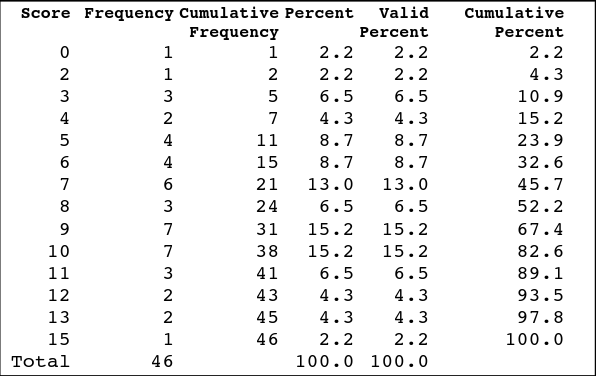
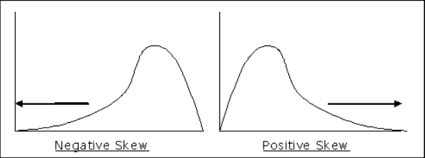
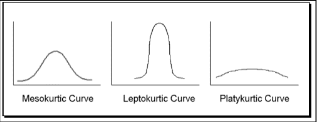
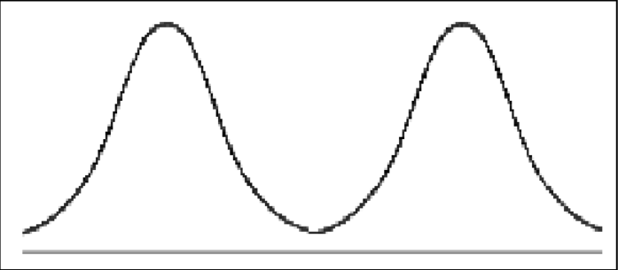
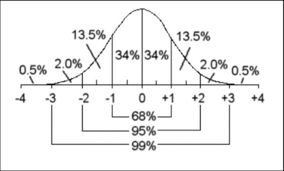

```{r}
#| lst-label: lst-r-libraries
#| lst-cap: "R libraries"

base::library(package = ggplot2)
base::library(package = knitr) # NOTE: For document rendering
base::library(package = quarto) # NOTE: For document framework
knitr::write_bib(
  x    = base::.packages(),
  file = "./refs/r_packages.bib"
)
```

```{r}
#| lst-label: lst-knitr-opts
#| lst-cap: "Knitr options"

base::options(knitr.kable.NA = "-")
```



# Overview and Introduction {#sec-overview}

## Objectives {#sec-text-learn-objs}

- Display data graphically and interpret graphs
- Recognize, describe, and calculate the measures of location of data (quantiles
  and percentiles)
- Recognize, describe, and calculate the measures of center tendency
- Recognize, describe, and calculate the measures of dispersion
- Understand the complementary value of visual and numeric descriptions of data
- Be able to compare and contrast the use cases for different metrics

## Introduction {#sec-introduction}

- Data, in it's raw form, is very 
  - Especially large data sets are likely to be borderline 



| Student | Q1 | Q2 | Q3 | Q4 | Q5 |
|---------|----|----|----|----|----|
| Student 1 | 1  | 0  | 1  | 1  | 0  |
| Student 2 | 0  | 1  | 0  | 1  | 1  |
| Student 3 | 1  | 1  | 1  | 0  | 0  |
| Student 4 | 0  | 0  | 1  | 0  | 1  |
| Student 5 | 1  | 1  | 0  | 1  | 1  |

- Realistically, we need a way to  our datasets in a way
that capture the overarching trends in the values
  - This can be done both  and via  statistics, and often times, both!
  - Though this is a statistics class, sometimes the graphs are the most
    understandable part of a research paper!



- The book is filled with examples and practices to get better at navigating
these, please try some of them!

# Descriptive Statistics {#sec-desc-stats}

## Percentiles and Quartiles {#sec-perc-quart}

-  are used to cut numerical data into 4 equal-sized  when the data is ordered smallest to largest
  - $Q_1$ (first quartile) is above 1/4 or 25% of the data
  - $Q_2$ (second quartile) is above 1/2 or 50% of the data, or the median
  - $Q_3$ (third quartile) is above 3/4 or 75% of the data
  - For example, if I state $Q_3 = 20$, that means that the value of 20 is above
    75% of the data
  - Used in [Box plots], we'll get to that in a bit



-  function the same as quartiles, but  the data into 100 equal-sized sections
  - For example, the at the 90th percentile, 90% of scores are lower
  - Percentiles are especially commonly used to describe roughly where  data points fall - this comes up often in standardized
    testing
  - The 25th percentile is equivalent to $Q_1$, 50th percentile is equivalent to
    $Q_2$ (and thus, the median), and the 75th percentile is equivalent to $Q_3$
  - For example, if I state that the 23rd percentile is $45$, then the value of
    45 is above 23% of the data

### A Formula for Finding the Kth Percentile {#sec-kth}

- Often times, we want to know what  corresponds to a certain
percentile in a dataset
  - We can use the following formula to calculate this

$$
i = \frac{k}{100}*(n + 1)
$$

- Where:
  - $i$ is the index or rank of the value when ordered smallest to largest
  - $k$ is the $k^{th}$ percentile
  - $n$ is the total number of data points

- If $i$ ends up being between two integers, i.e., a decimal, then we  up and down to the nearest ranks and take the average of their
integers
  - It's worth mentioning this is just one of  procedures for
  finding the $k^{th}$ percentile...

- For a formula like this, it is easiest to approach it algebraically, just
inserting the chosen values over the letters in the formula



### Example of Finding Kth Percentile

**Dataset:** 5, 6, 7, 8, 9 (ordered smallest to largest)

**Prompt:** What value corresponds to the 70th percentile?

$$
i = \frac{70}{100}*(5 + 1)
$$

$$
i = 0.70*6
$$

$$
i = 4.2
$$

We round $i$ up and down to the 4th and 5th ranks, which correspond to values 8
and 9 in the dataset, their average is 8.5 $\rightarrow$ 70th percentile



### A Formula for Finding the Percentile of a Value in a Data Set {#sec-perc}

- We can go the  direction to figure out what a specific
datapoint's percentile is

$$
\frac{x+0.5y}{n}*100
$$

- Where:
  - $x$ is the number of data points up to and NOT including the point of
  interest
  - $y$ the number of occurrences of the values of interest
  - $n$ is the total number of data points

- Like the prior formula, this is just *one* procedure, you may run into others
in the wild

### Example of Finding Percentile of a Value in a Data Set

**Dataset:** 5, 6, 7, 8, 9 (ordered smallest to largest)

**Prompt:** What percentile is value '8' at?

$$
\frac{3+0.5(1)}{5}*100
$$

$$
\frac{3.5}{5}*100
$$

$$
70 \rightarrow percentile
$$

- **WAIT!** Didn't we just say that 8.5 is the 70th percentile in the last
example?
  - Yes, that is because these formulas are only ,
  and work poorly in small datasets
  - There are several slight variations on calculating these, but the formulas
  above is what we will use for this class

## Descriptive Tables and Frequencies {#sec-desc-tables}

-  is a count of the  of cases – or frequency - that fall in the different  or that obtain certain scores.
  - E.g., - the number of girls and boys in a sample the number of students who
    identify themselves as African-American, Asian- American, Hispanic, or White
    on a questionnaire; the number of people who obtain different scores on a
    test

-  is the  or percentage of cases for each score in the distribution

-  is a count of the number of cases that fall
   a certain score. A cumulative frequency is provided for
  all scores in the distribution

-  is the  or
  percentage of cases that fall below a certain score.





## Measures of Central Tendency {#sec-central-tendency}

-  of a  are statistics that  scores that
  are typical, central or average in the distribution.
  - The most  measures of central tendency in the social
    sciences are the mode, the median, and the mean.

- The  is the most commonly  value in a
  variable/dataset
  - Mode is often just spelled out, and not given a special notation
  - There is not a very useful formula for finding the mode, but realistically
    all you need to do use [Bar Graphs] and find the  bar
    (for the highest frequency)

- Example of finding mode of a sample dataset:
  - I have 5 students with the following sexes: $\{F, M, F, F, M\}$
  - I have 3 female students, and 2 male students, thus the **sample mode of the sex
    variable is 'Female'**, as that is the most common value in that variable

- The  is
  the value at the 50th percentile, second quartile ($Q_2$), or, put simply, the
  value that  the data into two equal halves when ordered
  from smallest to largest
  - In the case that there is no actual exact middle value when ordered smallest
    to largest, we'd  the two middle-most values
  - Sample median  notation: $X_m$
  - Population median  notation: $M$
  - The best strategy for finding median is to order the values and then cross
    values off from both ends until you end up with one uncrossed value
  - To find the *location* of the median, one can do: $\frac{n + 1}{2}$, where:
    - $n$: number of observations/people

- Example of finding median of a sample dataset:
  - I have the following test scores: $\{23, 61, 35, 89, 74\}$
  - First, we have to order the data smallest to largest: $\{23, 35, 61, 74, 89\}$
  - If I cross off each side of the data: $\{\cancel{23, 35}, 61, \cancel{74, 89}\}$
  - Thus, my **sample median of test scores is 61** or $X_{M,TestScore} = 61$
  - Using the location formula: $\frac{5 + 1}{2} = 3 \rightarrow$ the 3rd number
    in the order is the median

- The  is
  the arithmetic average of the data
  - Sample mean  notation: $\bar{x}$ (x-bar)
  - Population mean  notation: $\mu$ (mu)
  - The sample mean is calculated with:

$$
\bar{x} = \frac{x_1 + x_2 + x_3 + .... + x_n}{n}
$$

- Example of finding mean of a sample dataset
  - I have the following GPAs: $\{1.00, 1.00, 2.50, 3.00, 4.00\}$
  - Using the formula: $\frac{1 + 1 + 2.50 + 3.00 + 4.00}{n} =
    \frac{11.50}{5} = 2.3$
  - Thus, **my sample mean of GPAs is 2.3** or $\bar{x}_{GPA} = 2.3$







## The Law of Large Numbers and the Mean {#sec-the-law-of-large-numbers}

- As a general rule, as the sample size ($n$) grows, $\bar{x}$ and $\mu$
converge - this is true of most statistic - parameter relationships
  - This is related to the central limit theorem, to be discussed slightly later
  - However, this also explains why bigger samples are often treated as  in a lot of scientific research - because the sample
  statistics better approximate the parameters



## Measures of Dispersion {#sec-dispersion}

-  are statistics that summarize
  how data is  out across a distribution
  - The most  measures of dispersion we should be concerned
    with are standard deviation, variance, range, and interquartile range.

- Each number in a dataset has a , or how  away
  it is from the mean
  - This is calculated simply as the  between the value
    and the sample mean of the data
  - $x - \bar{x}$ or
  - $x_i - \bar{x}$

- Example of calculating deviation of a single point:
  - We have dataset with $\bar{x} = 5$, and we are interested in the individual
    point of $10$
  - Using the deviation formula: $10 - 5 = 5$, thus the deviation of point 10 is
    5

- To calculate the standard deviation, we first will calculate the ,
  which is just the  standard deviation
  - Sample variance statistic: $s^2$
  - Population variance parameter: $\sigma^2$
  - The variance sample statistic and population parameter formulas are,
    respectively:

$$
s^2 = \frac{\sum{(x-\bar{x})^2}}{n-1}
$$

$$
\sigma^2 = \frac{\sum{(x-\mu)^2}}{n}
$$



- By far, the most important and most used way to describe the 
  of all the data is the 
  - A measure of the average  away from the mean that a point is in a distribution
  - It is used instead of variance because it removes the "square" from
    interpretation
  - Sample standard deviation statistic: $s$
  - Population standard deviation parameter: $\sigma$ (sigma)
  - The standard deviation sample statistic and population parameter formulas are,
    respectively:

$$
s = \sqrt{\frac{\sum{(x-\bar{x})^2}}{n-1}}
$$

$$
\sigma = \sqrt{\frac{\sum{(x-\mu)^2}}{n}}
$$





- The  is the  between the
  largest and smallest values in the data

- Example of calculating range in a sample:
  - Data: $\{4, 2, 6, 8, 20\}$
  - Subtracting smallest and largest values: $20 - 2 = 18$, **18 is the range of
    the sample**

- The  is the 75th percentile (upper quartile, $Q_3$) minus
  the 25th percentile (lower quartile, $Q_1$). It is the width of the interval
  that contains the  50% of the data.
  - In formula it could be represented as: $Q_3 - Q_1 = IQR$

## Calculating Measures of Dispersion {#sec-calu-measure-dispersion}

### Calculating Variance and Standard Deviation {#sec-var-std-dev}

While not necessary with computers and calculators, it can be useful to work
out statistics "by hand" for learning how they work. For example:

**Dataset:** 1, 2, 3, 4, 5

**Size of sample:** $n = 5$

**Sample Mean:**

$$
\bar{x} = \frac{x_1 + x_2 + x_3 + .... + x_n}{n}
$$

$$
3 = \frac{1 + 2 + 3 + 4 + 5}{5}
$$

**Sample Variance:**

$$
s^2 = \frac{\sum{(x-\bar{x})^2}}{n-1}
$$

Hint: whenever you see a $\sum$ sign, follow this tabular procedure

| x | x - xbar | (x-xbar)^2|
|---|----------|-----------|
| 1 | 1 - 3    | -2^2 |
| 2 | 2 - 3    | -1^2 |
| 3 | 3 - 3    | 0^2 |
| 4 | 4 - 3    | 1^2 |
| 5 | 5 - 3    | 2^2 |
|   | Sum      | 10         |

$$
2.5 = \frac{10}{5-1}
$$

**Sample Standard Deviation:**

$$
s = \sqrt{s^2}
$$

$$
1.58 = \sqrt{2.5}
$$

### Describing Points and Values with Standard Deviations (Z-scores) {#sec-desc-points}

- Much like describing a specific value with a percentile, we may want to
describe how far away from the  a certain point is, and we can
do so using the standard deviation

- We can do this with what are called  with the following formula for sample:

$$
z = \frac{x - \bar{x}}{s}
$$

- Where:
  $x$ is a individual data value of interest
  $s$ is the standard deviation

**By hand (pulling from last example):**

$$
-0.63 = \frac{2 - 3}{1.58}
$$

- We could then say that the value of 2 is -0.63 standard deviations away from
  the mean of 3



- Z-scores are often used in conjunction with [Percentiles and Quartiles], to
  describe a position of an individual in a broader dataset

## Aside on Outliers {#sec-aside-on-outliers}

- An , also known as an
  **extreme value**, is a data point that falls  from the
  others, somehow breaking from the pattern of the data
  - While more commonly applied to numeric data, it could sometimes be used to
    describe a single member of a qualitative 
  - It is characteristic for this point to have an extreme z-score, i.e., be
    many standard deviations away from the 



- Many graphical methods naturally  outliers in the data
  - In plots, you are mainly just looking for visual , or
    breaks in the visual pattern

## Descriptions of Distributions {#sec-id}

- There are several  that are not well described as
  either [Measures of Dispersion] or [Measures of Central Tendency], but still
  helpful in understanding the layout of a continuous distribution

- Usually, we use [The Normal Distribution] as an "ideal", and describe
  variables' distribution in how it  to the normal
  distribution
  - This is how we will describe [Skewness], [Kurtosis], and [Modality]

- There are several different ways to describe these 
  with numeric statistics, but for now, we'll just focus on how they appear
  graphically in a histogram

### Skewness {#sec-skew .fragment}

-  is a description of how a distribution
  departs from  or has a 'tail'
  - A : when a distribution has most values
    clustered towards the  end, and a tail out to the right
    side of the frequency histogram
  - A : when a distribution has most values
    clustered towards the  end, and a tail out to the left
    side of the frequency histogram





### Kurtosis {#sec-kurtosis .fragment}

-  is a description of how 'peaked' a distribution is
  - A  distribution has too many scores
    concentrated in the center and not  in the tails.
    (peaked)
  - A  distribution has too few scores in the center and too
    many in the . (flat)
  - [The Normal Distribution] is said to be 



### Modality {#sec-modality .fragment}

-  a description of how many  a distribution has
  - A distribution is  when is has only one peak, and  when it has two peaks





### The Normal Distribution {#sec-normal-dist .fragment}





- The  is a distribution of a 
  variable that is unimodal, symmetrical, mesokurtic, bell-shaped, and the mean, median, and
  mode are equal
  - Follows the 
  - We'll revisit this in it's own module later on



## Sampling Variability of Statistics {#sec-sampling-variability-of-stat}

- As mentioned prior, different  from the same population
  of interest will not be exactly the same, described as 
  - Thus, their data, means, standard deviations will all be somewhat different
    every time we take a new sample
  - If we were to take many  samples, we would see
    slight variation across all of them
  - Put together, they are all just different  of their
    parameters (but the parameter is what we are after!)
  - Review:
    - $\bar{x}$ estimates $\mu$
    - $X_M$ estimates $M$
    - $s$ estimates $\sigma$

# Descriptive Plots {#sec-desc-plots}

## Introduction {#sec-introduction-stem}

- In this first section, we looked at primarily statistics and numeric
  representations, now we'll look at some graphs used often to show  of certain values in the data



## Stem-and-Leaf Plots {#sec-stem-and-leaf}

- **Stem-and-leaf graphs**, also known as **stemplots**, are technically a  method to represent data - but function to visually inspect
the distribution of the data.

- Stemplots a valid choice for representing , quantitative
data for a single variable
  - However it works  if the range of values is reasonably
  restricted, and with the same decimal structure
  - Continuous data  work, but discrete data can be somewhat
  easier
  - E.g., Test scores ranging from 0 - 100 $\rightarrow$ !
  - E.g., Reaction time ranging from 0.50 secs - 420 seconds $\rightarrow$ !

- Stemplots contain a **leaf** which contains the **final significant digit**
(in practice this is usually just the  digit)
  - Then, the  is everything *but*, the digits of the leaf
  - Each number entry in a leaf represents a different value in the data
  - So technically, the number of digits that are leaves in the  of points in the data

- Practically, stemplots are  showing distribution, skew,
and frequency of values
  - Especially common in 
  - However, I do find they are  to interpret for
  non-statistical audiences

- Example of test scores 0 - 100: 2, 3, 5, 6, 9, 11, 14, 15, 16, 20, 21, 23, 27,
30, 32, 38, 41, 44, 46, 53, 55, 59, 60, 62, 67, 74, 79, 81, 85, 90

| Stem | Leaf      |
|------|-----------|
|  0   | 2 3 5 6 9 |
|  1   | 1 4 5 6 |
|  2   | 0 1 3 7 |
|  3   | 0 2 8 |
|  4   | 1 4 6 |
|  5   | 3 5 9 |
|  6   | 0 2 7 |
|  7   | 4 9 |
|  8   | 1 5 |
|  9   | 0 |



- As you'll see in the following line and bar graphs, one difference is that
stemplots don't actually aggregate or summaries the data at all
  - One nice thing about these plots is that they actually leave the numbers
  somewhat , so you can see the entire dataset at a glance

## Line Graphs {#sec-line-graphs}

- **Line graphs** are a broad family of plots that always have some dotted data
points  by a continuous line
  - For our purpose, they are another way to visualize 
  of data points

- Unlike stemplots, they could technically be used for qualitative data (but I
wouldn't recommend that use)
  - Otherwise, the same rules for  apply from the
  stemplots

- In the line plot:
  - The height, or **y-axis**, represents the  of a
  certain value
  - The place on the **x-axis** represents what value's frequency is  by the y-axis

```{r}
#| label: fig-line
#| fig-cap: "Frequency of Quiz Grades (0-10)"

# Example data: quiz grades from 0 to 10
quiz_grades <- c(0, 1, 2, 3, 4, 5, 5, 6, 7, 7, 7, 8, 9, 9, 10)

# Convert quiz grades into a data frame
grades_df <- data.frame(grade = quiz_grades)

# Create the frequency table of grades
grade_freq <- as.data.frame(table(grades_df$grade))
colnames(grade_freq) <- c("grade", "frequency")

# Plot the frequency line graph
ggplot(grade_freq, aes(x = as.numeric(grade), y = frequency)) +
  geom_line(group = 1, color = "blue", size = 1) + # Line plot
  geom_point(color = "red", size = 3) + # Points on the line
  labs(
    title = "",
    x = "Quiz Grade",
    y = "Frequency"
  ) +
  theme_minimal() +
  scale_x_continuous(breaks = 0:10) # Show ticks for each grade
```



## Bar Graphs {#sec-bar-graphs}

-  help show  of values of
  categorical/nominal variables

```{r}
#| label: fig-bar
#| fig-cap: "Frequency of Students by Class"

# Example data: Student classifications
student_classes <- c(
  "Freshman", "Sophomore", "Junior", "Senior",
  "Freshman", "Junior", "Senior", "Senior",
  "Sophomore", "Junior", "Freshman", "Freshman",
  "Sophomore", "Senior", "Junior"
)

# Convert student classes into a data frame
student_df <- data.frame(class = student_classes)

# Create a frequency table of student classes
class_freq <- as.data.frame(table(student_df$class))
colnames(class_freq) <- c("Class", "Frequency")

# Plot the bar graph
ggplot(class_freq, aes(x = Class, y = Frequency, fill = Class)) +
  geom_bar(stat = "identity") + # Bar chart with precomputed frequencies
  labs(
    title = "",
    x = "Class",
    y = "Frequency"
  ) +
  theme_minimal() +
  scale_fill_brewer(palette = "Set3") # Optional color palette
```

```{r}
#| label: fig-bar-split
#| fig-cap: "Frequency of Students by Class and Sex"

# Example data: Student classes and their corresponding genders
student_data <- data.frame(
  class = c(
    "Freshman", "Sophomore", "Junior", "Senior",
    "Freshman", "Junior", "Senior", "Senior",
    "Sophomore", "Junior", "Freshman", "Freshman",
    "Sophomore", "Senior", "Junior"
  ),
  gender = c(
    "Male", "Female", "Male", "Female",
    "Female", "Male", "Male", "Female",
    "Female", "Female", "Male", "Male",
    "Female", "Male", "Female"
  )
)

# Create a frequency table of student classes and genders
class_gender_freq <- as.data.frame(table(student_data$class, student_data$gender))
colnames(class_gender_freq) <- c("Class", "Sex", "Frequency")

# Plot the side-by-side bar graph
ggplot(class_gender_freq, aes(x = Class, y = Frequency, fill = Sex)) +
  geom_bar(stat = "identity", position = "dodge") + # Side-by-side bars
  labs(
    title = "",
    x = "Class",
    y = "Frequency"
  ) +
  theme_minimal() +
  scale_fill_brewer(palette = "Set3") # Optional color palette
```



## Frequency Histograms {#sec-histograms .fragment}

- A , at first glance, looks much like a  plot, as described prior.

- However, rather than use individual discrete points or labels, histograms will
   values by a defined , and count the frequencies of
  values within that bin
  - All the intervals will be the same , and we choose that
    width somewhat arbitrarily
  - But, its worth noting that the bin interval can have a 
    impact on the overarching interpretation



```{r}
#| label: fig-hist-good
#| fig-cap: "Example of a Histogram (Bin width = 2)"

# Generate a normal distribution with 1000 samples
data <- data.frame(value = rnorm(1000, mean = 50, sd = 10)) # Normal distribution

# Histogram with more reasonable binwidth (revealing the normal distribution)
ggplot(data, aes(x = value)) +
  geom_histogram(binwidth = 2, color = "black", fill = "skyblue") + # Smaller binwidth
  labs(x = "Value", y = "Frequency") +
  theme_minimal()
```

## Frequency Polygons {#sec-freqs}



- **Frequency polygons** can be though of as a line plot that that travels
through the  of histogram bars
  - So frequency polygons still use those same  widths as with
  histograms, but don't show that on the graph itself (unless overlaid)
  - This makes them more appropriate for dealing with continuous data

```{r}
#| label: fig-freq-poly
#| fig-cap: "Frequency polygon"

ggplot(data, aes(x = value)) +
  geom_freqpoly(binwidth = 1, color = "red", size = 1) + # Frequency polygon
  labs(x = "Value", y = "Density") +
  theme_minimal()
```

## Box Plots {#sec-box-plots}

-  are
  useful for representing information about the quartiles, percentiles, and  all in a single plot
  - Also called **box-and-whisker** plots (may be the preferred name for the
    cat-lovers like myself)

- The  of a box plot represents a median, edges of the
  box represent $Q_1$ and $Q_3$ (i.e., the box is the IQR), the whiskers
  *usually* extend to the farthest values

```{r}
#| label: fig-boxplot
#| fig-cap: "Boxplot example"

data <- data.frame(
  category = rep(c("A", "B", "C"), each = 20),
  value = c(rnorm(20, mean = 5), rnorm(20, mean = 7), rnorm(20, mean = 6))
)

ggplot(data, aes(x = category, y = value)) +
  geom_boxplot() +
  labs(x = "Category", y = "Value")
```

## Practicing Choosing Descriptives and Plots {#sec-practice-choosing}

- Not all plots and descriptive statistics provide the 
  information - try the following questions for practice







## Aside about Lying in Statistics {#sec-lying}

- With all of these different methods (any many more!) for 
representing data, we run into an issue: accidental or purposeful misleading
with graphs
  - *"There are three kinds of lies: lies, damned lies, and statistics"* - Mark
  Twain (kind of, its complicated who exactly came up with this)
  - While often times taken out of context, this statement does ring true
  sometimes - we owe it to our readers to be careful



- Aim for *consistency and clarity in graphing*, avoiding 
axis points, confusingly similar colors, and making sure enough information is
included to understand the scale of the plot.
  - Easy tip: see if you can show the plot to someone not knowledgeable in the
  work and see if it makes sense to them

# Conclusion {#sec-conclusion}

## Recap {#sec-recap}

- Understanding our data first starts with describing it, and we can accomplish
that both through informative statistics and graph

- Measures of central tendency and dispersion can succinctly describe the center
of data, and how spread out it is, respectively. They can be a useful way to
quickly describe data in numbers.

- The various graphs show slightly different information, and multiple options
may be used simultaneously to more thoroughly show the characteristics of
the data

- The statistics we calculate on our sample are meant to accurately estimate the
parameters of the population distribution, but that only works if our sample is
representative and our data unbiased!

- Outliers and discussion on skew/kurtosis will return later when we are talking
  about their impact on inferential statistics, but don't worry too much about
  that yet!

::: {.content-visible when-format="revealjs"}

## Lecture Check-in {#sec-lecture-check-in}

- Make sure to complete any lecture check-in tasks associated with this lecture!

:::
